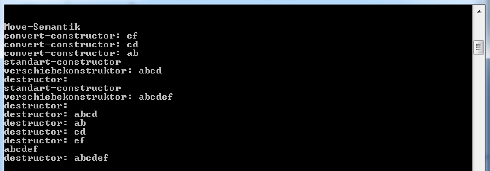

#Uebung 1

###Code-Coverage
Bevor Abgabe  

###Zuweisungsoperator
Um zu verhindern, dass der Zuweisungsoperator einer Klasse verwendet werden kann, kann man den automatisch generierten Operator löschen:

    class String {
    	String(const String&) = delete;
    }

Weiter gäbe es noch die optin den automatisch generierten Operator zu überschreibun und jeweils nur sich selbst zurück geben, so wird das alte Objekt nicht gelöscht und das Objekt erhält sich selbst zugewiesen:

    
    String& operator=(String&& s) {
		return *this;
	}

###Move-Semantik

statt das jedes Mal das String-Objekt breit Kopiert wird, wird lediglich das vorher erzeugte Objekt verschoben jeweils verschoben. Dies spart den Aufwand für eine tiefe Kopie.